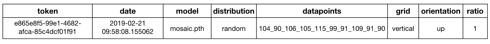
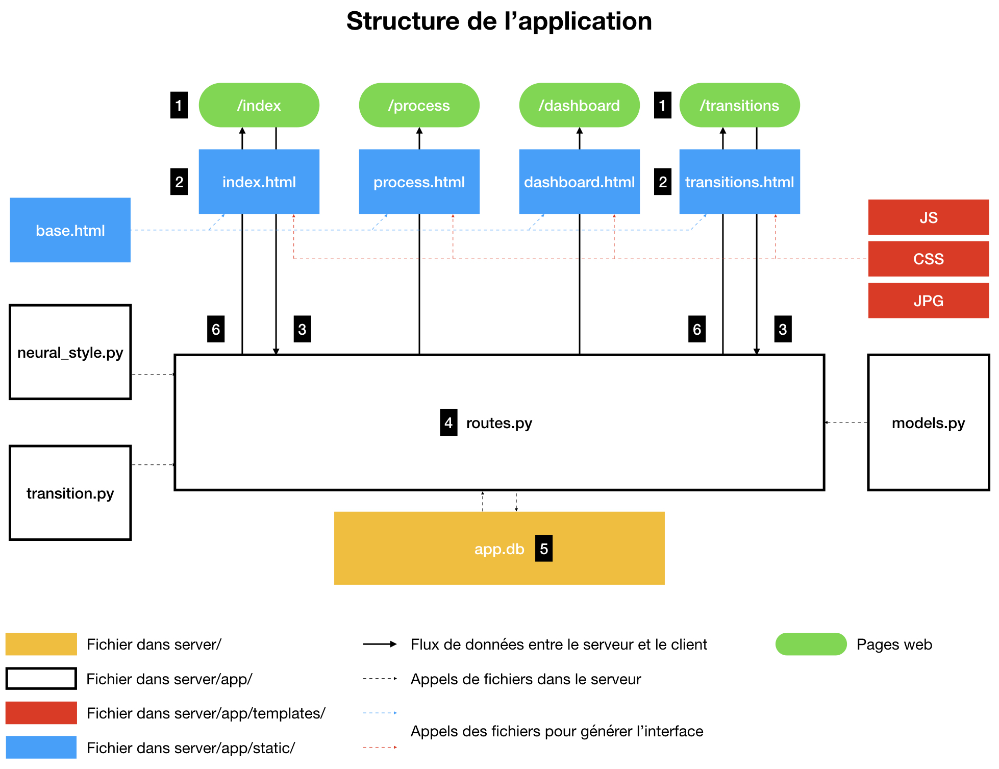
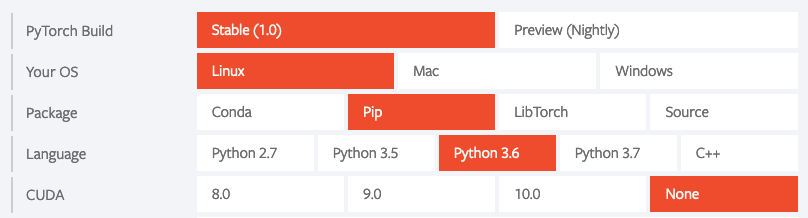

# Documentation

Le fichier suivant détaille le fonctionnement de l'application ainsi que la configuration du serveur Digital Ocean à l'issue du mois de mars 2019. Voici la structure de la documentation :

[Application](#application)
* Structure
* Données
* Processus
* Travailler en local avec l'application
* Charger un nouveau modèle

[Serveur](#serveur)
* Accès au serveur
* NGINX
* Python, Gunicorn & Flask
* Mise à jour de l'application

# Application

Nous détaillons dans cette partie les aspects importants de l'application. Nous évoquons ainsi :
* **Structure** : quelles sont les pièces de l'application et comment elles intéragissent en elles.
* **Données** : quelles sont les différentes données utilisées par l'application et en quoi elles sont utiles.
* **Processus** : quels sont les processus importants à l'oeuvre lors de l'exécution de l'application.
* **Travailler en local avec l'application** : comment mettre en place localement le repository GitHub de l'application.
* **Charger un nouveau modèle** : comment implémenter un nouveau modèle sur l'application.

## Structure

Le [site](https://gan4vis.net) actuel est constitué de quatre pages web.

* [/index](https://gan4vis.net/index) : accueil accessible à [https://gan4vis.net](https://gan4vis.net) permettant d'effectuer le transfert de style.
* [/process](https://gan4vis.net/process) : page accessible depuis l'accueil détaillant le processus de création de la plateforme
* [/dashboard](https://gan4vis.net/dashboard) : page non accessible depuis l'accueil, uniquement accessible à [https://gan4vis.net/dashboard](https://gan4vis.net/dashboard) présentant un tableau de bord d'utilisation de la fonctionnalité transfert de style.
* [/transitions](https://gan4vis.net/transitions) : page accessible à [https://gan4vis.net/transitions](https://gan4vis.net/transitions)

L'application permettant de gérer ce site a une structure MVT (Model View Template). Elle fait appel à un ensemble de fichiers statiques ainsi qu'une base de donnée SQLite. Ci-dessous un schéma de l'architecture de l'application :

<p align="center">

</p>

Sur le schéma précédent, les Templates sont en bleu. En blanc se trouvent les Views (routes.py) et les Models (models.py). Un fichier python appelé neural_style.py permet le chargement et l'application des modèles de transfert de style utilisés.

## Données

Les données manipulées par l'application sont de trois formes, modèles, images et base SQLite

### Modèles

Les modèles sont des fichiers `.pth` stockés dans le dossier `gan4vis/server/app/gan/saved_models`. Nous pouvons générer les modèles pour l'application de transfert de style comme pour celle de transitions. Pour entrainer un modèle de transfert de style il suffit de suivre la procédure expliquée sur page de [fast-neural-style](https://github.com/pytorch/examples/tree/master/fast_neural_style "GitHub de fast-neural-style") qui est l'implémentation en pytorch que nous avons utilisée.

### Images

Les images stockées sur le serveur correspondent aux images générées lors de chaque transfer de style ainsi que les images utiles dans les affichages divers. Toutes les images se trouve dans les sous dossiers de `gan4vis/server/app/static`.

### Base SQLite

Nous avons opté pour une base SQLite pour enregistrer les configurations des transferts de style réalisés. Cette base correspond au fichier `gan4vis/server/app.db`. Elle est constituée d'une unique table appelée transfer. Nous avons fait le choix d'utiliser [SQLAlchemy](https://www.sqlalchemy.org/) pour travailler avec la base dans notre application. La structure de la base est reliée au fichier "models.py". Celui-ci definit une classe appelée "Transfer" qui correspond à la table de la base. Les colonnes de cette table correspondent aux aspects des transferts de style dont nous souhaitons garder la trace. Ci-dessous un exemple d'entrée de la table.

<p align="center">

</p>

* **token** : identifiant unique généré automatiquement correspondant à un transfert de style. Cet identifiant permet de nommer l'image et est intégré à l'URL afin de pouvoir partager et recharger un transfert de style. Ce point sera détaillé plus bas.
* **date** : date du transfert de style.
* **model** : modèle utilisé
* **distribution** : distribution utilisée
* **datapoints** : valeurs des points utilisés dans le graphique, reliés par des "_"
* **grid** : type de grille utilisé
* **orientation** : orientation de la figure
* **ratio** : niveau de zoom décidé par l'utilisateur

**Attention** Tout changement dans le fichier "models.py" doit être effectué avec précaution. Tout changement doit être suivi d'une migration avec les étapes suivantes

```console
$ flask db migrate
$ flask db upgrade
```

Des modifications importantes pourront nécessiter une adaptation des données précédentes et donc une intervention sur la base. Nous renvoyons vers le [tutoriel Flask de Miguel Grinberg](https://blog.miguelgrinberg.com/post/the-flask-mega-tutorial-part-iv-database) pour voir comment accéder et modifier la base de données depuis la ligne de commande.

## Processus

Nous allons à présent détailler le processus à l'oeuvre lors de l'utilisation de chacune des pages web. Nous détaillerons plus particulièrement les opérations liées au transfert de style et à la transition.

### Transfert et transition

<p align="center">

</p>

<table>
  <tr>
    <td></td>
    <td>Transfert</td>
    <td>Transition</td>
  </tr>
  <tr>
    <td>1</td>
    <td colspan="2">L'utilisateur se connecte à l'interface de transfert ou de transition.</td>
  </tr>
  <tr>
    <td>2</td>
    <td colspan="2">L'interface est générée par aggrégation de l'information venant du serveur et un ensemble de fichiers (html, js, css et images). L'utilisateur peut alors paramètrer le transfert de style ou la transition.</td>
  </tr>
  <tr>
    <td>3</td>
    <td colspan="2">L'utilisateur clique sur le bouton d'application du transfert de style ou de la transition. Une requête AJAX part alors du serveur contenant les paramètres de l'opération ainsi qu'une chaîne de caractères correspondant à l'image d'entrée.</td>
  </tr>
  <tr>
    <td>4</td>
    <td>Une fonction "treatment" présente dans le fichier "routes.py" est alors en charge du transfert de style, un token est défini correspondant à l'opération. La fonction appelle une fonction présente dans "gan/neural_style.py" qui sauvegarde l'image de sortie en la nommant à l'aide du token.
    <td>Une fonction "treatment_transitions" présente dans le fichier "routes.py" est alors en charge du transfert de style, un token est défini correspondant à l'opération. La fonction appelle une fonction présente dans "gan/transition.py" qui sauvegarde l'image de sortie en la nommant à l'aide du token.</td>
  </tr>
  <tr>
    <td>5</td>
    <td>Les paramètres d'entrée et de sortie du transfert sont sauvegardés dans la base de données grâce au fichier "models.py" en utilisant le token défini précédemment.</td>
    <td>Sont sauvegardés dans la base de données (dans une table à part), l'image du tracé de l'utilisateur, le nom de l'image d'arrivée, le nom de l'image de sortie et le chemin vers le GIF généré.</td>
  </tr>
  <tr>
    <td>6</td>
    <td colspan="2">Le token de l'opération est envoyé sur le client. Son arrivée sur le client permet une mise à jour de l'URL par jQuery et une mise à jour de l'image de sortie par requête GET de l'image correspondant à l'identifiant au serveur.</td>
  </tr>
</table>

### Dashboard

Un système de dashboard a été mis en place afin de rendre compte de l'utilisation de la partie transfer de style ouverte au public. Une simple route appelée "dashboard" a été créée. Elle parcourt la base de données afin d'envoyer au client les données d'utilisation. Le client les exploite ensuite à l'aide de D3.js (version 5) afin de créer les graphiques.

### Partage d'URL

Nous avons souhaité pourvoir partager notre application de transfert de style par URL. Le but étant qu'après avoir généré un transfert, l'utilisateur puisse le partager à quelqu'un qui rechargerait la page à son tour avec toutes les données d'entrée et sortie de l'image initiale. La route "index" est le coeur du processus qui permet cela

```python
@app.route('/index', methods=['GET', 'POST'])
def index():
    token = request.args.get('token')
    app.logger.info("index token={}".format(token))
    dict_transfer = {"token":"placeholder","model":"mosaic.pth","distribution":"random","datapoints":"","grid":"vertical","orientation":"up","ratio":2} # Start ratio at 2 to be able to activate both zooms on page load
    if token:
        transfer = Transfer.query.filter_by(token=token).first()
        dict_transfer = {"token":transfer.token,"model":transfer.model,"distribution":transfer.distribution,"datapoints":transfer.datapoints,"grid":transfer.grid,"orientation":transfer.orientation,"ratio":transfer.ratio}
    return render_template('index.html', title='GAN4VIS', dict_transfer=dict_transfer)
```

Cette route est la fonction déclenchée sur le serveur à chaque fois qu'un utilisateur se rend sur l'URL https://gan4vis.net/index. Bien qu'aucun argument ne soit présent dans la route `()`, la fonction reçoit en réalité systématiquement une information du client. En effet, la ligne : `token = request.args.get('token')` va rechercher une information de l'URL du client du type "y a-t-il un argument "token" dans l'URL ?". Ainsi :

* https://gan4vis.net/index : token = None
* https://gan4vis.net/index?token=558af5eb-db76-4f7f-b500-536d123f3b30 : token = 558af5eb-db76-4f7f-b500-536d123f3b30

Par la suite, un dictionaire est initialisé dans la route en fonction de la présence d'information sur le token. Si le token est spécifié, une configuration lui correspondant sera cherchée dans la base de donnée. Sinon une configuration par défaut sera utilisée. Enfin, les codes html et javascript utilisés sur le client on été adaptés afin de fonctionner dans les deux cas.

## Travailler en local avec l'application

Pour travailler en local avec l'application, il suffit de cloner le respository sur votre machine.

```console
$ git clone https://github.com/AmigoCap/gan4vis.git
```
Avant de lancer l'application trois points doivent être configurés. En effet, la base de données SQLite et les fichiers de logs doivent être configurés.

Tout d'abord installer les requirements nécessaires liés au fichiers `gan4vis/server/requirements.txt`.

```console
$ pip install -r requirements.txt
```

Par expérience l'installation de PyTorch peut être délicate. Installer donc PyTorch manuellement. La manière de procéder la plus simple semble encre être d'aller sur [le site de PyTorch](https://pytorch.org/) et de déterminer la commande pip en fonction de la configuration de la machine. La version de PyTorch sans CUDA peut être utilisée.

Configurer ensuite les logs en créant un fichier qui les stockera. Ce dossier se trouve dans `gan4vis/server`.

```console
$ mkdir logs
```

Dans le dossier `gan4vis/server`, configurons la base de données. Entrer les commandes suivantes :

```console
$ flask db init
$ flask db migrate -m "Database Initialization"
$ flask db upgrade
```

## Charger un nouveau modèle

Nous supposons à présent que l'application fonctionne et que vous souhaitez à ajouter un nouveau modèle de transfert de style. Pour cela, vous avez au préalable entrainé un modèle comme expliqué dans la partie Données - Modèles plus haut. À l'issue de l'entraînement vous obtenez un fichier `.pth`. Nous allons voir dans cette partie où ajouter ce fichier et comment le rendre utilisable depuis l'interface.

### 1. Placer les ressources nécessaires dans l'application

Les ressources nécessaires à l'ajout d'un modèle sont :
* Un modèle entraîné au format `.pth`
* Une image de style au format `.jpg`
* Une image d'affichage au format `.jpg`

**Modèle entrainé**

Le fichier `nom_modele.pth` doit être placé dans le dossier `gan4vis/server/app/gan/saved_models`. Dans `nom_modele`, les mots doivent être séparés par des `_`.

**Image de style**

Dans la fonction `treatment()` présente dans `gan4vis/server/app/routes.py` , l'image de style est affectée en image de font lors d'un transfert de style. Nous avons donc besoin de rendre disponible l'image de style. Pour cela sauvegarder l'image de style sous forme `nom_modele.jpg` dans le dossier `gan4vis/server/app/static/style-images`, où `nom_modele` correspond au nom du fichier `.pth` chargé plus haut, sans l'extension.

**Image d'affichage**

Sur l'interface, l'image de style est présentée en choix. Une image d'affichage est pour cela nécessaire. Cette image correspond à une version carré, à qualité réduite de l'image de style. L'image d'affichage doit être placée dans `gan4vis/server/app/static/utilitaries_images` sous la forme `nom_modele.jpg`, où `nom_modele` correspond au nom du fichier `.pth` chargé plus haut, sans l'extension.

### 2. Connecter le serveur au modèle

Le fichier `gan4vis/server/app/gan/neural_style.py` est le fichier chargeant les modèles et réalisant le transfert de style. Au début du script, les modèles sont chargés au démarrage du serveur. C'est là que nous avons besoin d'effectuer une modification. Ajouter au dictionnaire existant une nouvelle clé correspondant au nom du fichier `.pth` avec extension. Y affecter une valeur `None`

```python
# Create dictionary storing the models
models = {"mosaic.pth" : None, "udnie.pth" : None, "map.pth" : None, "pollock.pth" : None, "nom_modele.pth" : None}
```
Les deux étapes précédentes terminées, le serveur est configuré pour faire fonctionner le modèle. Nous pouvons à présent nous occuper de l'interface.

### 3. Rendre le modèle utilisable depuis l'interface

Au niveau de l'interface, la selection d'un modèle se fait par clic de l'utilisateur sur l'image du modèle. Il est donc nécessaire d'assurer que l'image soit bien présente et que les mécanismes associés fonctionnent.

**processing_index.js**

Aucun changement n'est à effectuer sur `processing_index.js`, nous expliquons juste ici comment est géré un modèle sur l'interface. `processing_index.js` gère les intéractions sur la page d'accueil et est en charge de l'envoi de la requête AJAX au serveur. Cette requête contient entre autres le nom du modèle à utiliser. La récupération du modèle utilisé est permise par le morceau de code suivant :

```javascript
var image_click = function(image){
   $('.selected').removeClass('selected'); // removes the previous selected class
   $(image).addClass('selected'); // adds the class to the clicked image
   image_style_selected = document.getElementsByClassName("image_style selected")[0].id
};
```

Les deux premières lignes sont en charge de modifier l'aspect de l'image sélectionnée. La troisième va récupérer l'identifiant de l'image sélectionnée. C'est cet identifiant qui sera envoyé dans la requête AJAX. L'ajout d'un modèle se résume donc à l'ajout du code html dans `index.html` traité par cette dernière ligne.

**index.html**

Le fichier `index.html` permet de gérer l'affichage de la page d'accueil. Le morceau suivant est en charge de l'affichage des modèles. Complèter comme ci-dessous un des blocks affichant un modèle.

```html
<div id="interface_gans" style="width:35%; float: right; height:30%;margin-left:7.5%;margin-right:7.5%">
	<table style="width:100%; table-layout: fixed">
	<tr>
		<td style="width: 25%">
		
		</td>
		<td style="width: 25%">
		
	  </td>
		<td style="width: 25%">
		
		</td>
		<td style="width: 25%">
		
		</td>
	</tr>
	</table>
</div>
```

Ces étapes terminées le modèle devrait être utilisable depuis l'interface.

# Serveur

À fin mars 2019 le serveur à la configuration suivante :

* 8 GB Memory
* 160 GB Disk
* Ubuntu 18.04.1 x64

Nous détaillons dans cette partie les aspects important de la gestion et de la mise en place du serveur. Nous évoquons ainsi :
* **Accès au serveur** : comment se connecter en SSH et créer de nouveaux utilisateurs ayant des droits administrateurs.
* **NGINX** : comment et configurer le serveur web qui constitue la base de l'application
* **Python, Gunicorn & Flask** : comment configurer Gunicorn et Flask au dessus de NGINX pour finaliser le déploiement de l'application
* **Mise à jour de l'application** : comment mettre à jour l'application au fil de l'évolution du présent repository GitHub.

## Accès au serveur

Les ressources nécessaires à la création d'un utilisateur et à l'administration de ses droits peuvent être trouvées ci-dessous :
* [Initial Server Setup with Ubuntu 18.04](https://www.digitalocean.com/community/tutorials/initial-server-setup-with-ubuntu-18-04)
* [How to Set Up SSH Keys on Ubuntu 18.04](https://www.digitalocean.com/community/tutorials/how-to-set-up-ssh-keys-on-ubuntu-1804)

L'accès au serveur se fait par SSH. Nous déconseillons très fortement d'utiliser la console de l'hébergeur depuis un navigateur car les copier-collers fonctionnent mal et toutes les touches du clavier n'y fonctionnent pas correctement. Depuis une console et avec un accès SSH, il est possible de se connecter en mode root `ssh root@ip-server` ou utilisateur `ssh utilisateur@ip-server`. Nous résumons ci-dessous succintement les étapes nécessaires à la création d'un nouvel utilisateur. Il est conseillé de faire les étapes suivantes en root.

### 0. Activer le firewall

Une configuration du firewall est nécessaire Dans notre cas, elle se résume à :

```console
ufw allow OpenSSH
ufw enable
```

### 1. Créer un nouvel utilisateur

Créons à présent l'utilisateur.

```console
# adduser utilisateur
```

Entrer alors les informations requises ainsi que son mot de passe.

### 2. Donner l'accès root à l'utilisateur

```console
# usermod -aG sudo utilisateur
```

### 3. Configurer le SSH du nouvel utilisateur pour l'accès root

Ouvrir le fichier "~/.ssh/authorized_keys" du root :

```console
# nano ~/.ssh/authorized_keys
```

Puis y ajouter la clé ssh de l'utilisateur. Cette suite d'étape terminée, vérifier que l'utilisateur arrive bien à se connecter en root.

### 4. Configurer le SSH du nouvel utilisateur pour accès utilisateur

La configuration se fait automatiquement sur demande de l'utilisateur. Il lui suffit d'ouvrir une session dans sa console et de rentrer la ligne suivante. Il aura alors à rentrer le mot de passe root.

```console
$ ssh-copy-id utilisateur@ip-server
```

Une fois l'opération terminée, l'utilisateur pourra se connecter normalement au serveur en SSH. Si la commande ssh-copy-id ne fonctionne pas, cela signifie que son système ne la supporte pas, reportez-vous alors à [How to Set Up SSH Keys on Ubuntu 18.04](https://www.digitalocean.com/community/tutorials/how-to-set-up-ssh-keys-on-ubuntu-1804).

## NGINX

Maintenant qu'un utilisateur tout puissant est configuré, nous allons pouvoir créer l'application.

Les ressources utilisées sont disponibles ici :
* [How To Install Nginx on Ubuntu 18.04](https://www.digitalocean.com/community/tutorials/how-to-install-nginx-on-ubuntu-18-04)

[NGINX](https://fr.wikipedia.org/wiki/NGINX) est la première couche sur laquelle est assise l'application. NGINX permet entre autres la gestion des requêtes. Nous détaillons ci-dessous les étapes nécessaires au paramétrage de NGINX sur une machine Ubuntu 18.04.1.

En pré-requis de cette étape, nous considérons que :
*Un utilisateur disposant des droits administrateur connaissant le mot de passe root est configuré et exécute ces étapes.

### 1. Installation

Installer tout dabord la dernière version de NGINX.

```console
$ sudo apt update
$ sudo apt install nginx
```

### 2. Configuration du pare-feu

Autoriser NGINX à gérer les requêtes :

```console
$ sudo ufw allow 'Nginx HTTP'
```

### 3. Vérification

Vérifier que les requêtes avec NGINX sont bien autorisées :

```console
$ sudo ufw status
```

Dans l'état actuel du serveur, les lignes suivantes apparaissent.

```console
To                         Action      From
--                         ------      ----
OpenSSH                    ALLOW       Anywhere                  
Nginx HTTP                 ALLOW       Anywhere                  
OpenSSH (v6)               ALLOW       Anywhere (v6)             
Nginx HTTP (v6)            ALLOW       Anywhere (v6)      
```

Vérifier que tout fonctionne bien :

```console
$ systemctl status nginx
```
La sortie doit montrer l'activation du serveur :

```console
Output
nginx.service - A high performance web server and a reverse proxy server
   Loaded: loaded (/lib/systemd/system/nginx.service; enabled; vendor preset: enabled)
   Active: active (running) since Fri 2018-04-20 16:08:19 UTC; 3 days ago
     Docs: man:nginx(8)
 Main PID: 2369 (nginx)
    Tasks: 2 (limit: 1153)
   CGroup: /system.slice/nginx.service
           ├─2369 nginx: master process /usr/sbin/nginx -g daemon on; master_process on;
           └─2380 nginx: worker process
```

## Python, Gunicorn & Flask

L'ensemble des ressources utilisées se trouvent au lien suivant :
* [How To Serve Flask Applications with Gunicorn and Nginx on Ubuntu 18.04](https://www.digitalocean.com/community/tutorials/how-to-serve-flask-applications-with-gunicorn-and-nginx-on-ubuntu-18-04)

Cette étape permet la configuration des seconde et troisième couches de l'application. La seconde couche consiste en [Gunicorn](https://fr.wikipedia.org/wiki/Gunicorn) qui est un serveur web HTTP WSGI. La troisième couche correspond au serveur Flask.

En pré-requis de cette étape, nous considérons que :
* Un utilisateur disposant des droits administrateur connaissant le mot de passe root est configuré et exécute ces étapes.
* NGINX a été configuré et est actif comme présenté précédemment.

### 1. Installation Python et dépendances

Installons tout d'abord Python et l'ensemble des ressources associées

```console
$ sudo apt update
$ sudo apt install python3-pip python3-dev build-essential libssl-dev libffi-dev python3-setuptools
```

### 2. Création du dossier du serveur

Avant d'aller plus loin, faisons un point sur la structure actuelle des dossiers de la machine. L'entrée de la commande `pwd` doit vous donner l'affichage suivant :

```console
└── home
   └── utilisateur
```

Nous voulons aller vers une structure qui ressemble à ça :

```console
└── home
   └── utilisateur
      └── gan4vis
```

Nous allons donc à présent devoir créer le dossier de l'application. Nous allons simplement effectuer un git clone du directory GitHub. Nous avons tout d'abord à installer Git :

```console
$ sudo apt-get install -y git
```

Créer maintenant un clone du directory GitHub dans le dossier `/home/utilisateur`:

```console
$ git clone https://github.com/AmigoCap/gan4vis.git
```

### 3. Initialiser un environnement virtuel

Comme notre serveur ne se trouve pas directement à la racine du repository GitHub, déplaçons-nous dans le dossier de l'application pour réaliser les étapes suivantes.

```console
$ cd gan4vis/server
```

L'application utilise un certain nombre de modules Python. Nous allons donc créer un environnement virtuel afin de délimiter clairement le périmètre du serveur. Installons tout d'abord la ressource permettant de créer un environnement virtuel.

```console
$ sudo apt install python3-venv
```

Créons ensuite l'environnement virtuel.

```console
$ python3.6 -m venv gan4vis_env
```

Une fois l'environnement créé, nous allons l'activer en le définissant comme source. Cela permettra d'installer les modules nécessaires. À terme, l'application utilisera toujours cet environnement virtuel.

```console
$ source gan4vis_env/bin/activate
```

La commande précédente doit avoir modifié votre console qui commence désormais par : `(gan4vis_env)`.

Commençons à installer les modules. Tout d'abord, installer wheel.

```console
$ pip install wheel
```

Installer ensuite l'ensemble des modules utilisés par l'application. Pour cela utiliser le fichier `gan4vis/server/requirements.txt` :

```console
$ pip install -r requirements.txt
```

Par expérience l'installation de PyTorch peut être délicate. Nous décidons donc d'installer PyTorch manuellement. La manière de procéder la plus simple semble encore être d'aller sur [le site de PyTorch](https://pytorch.org/) et de déterminer la commande pip en fonction de la configuration de la machine. La version de PyTorch sans CUDA peut être utilisée. Dans notre cas :

<p align="center">

</p>

Nous installons donc PyTorch de la manière suivante, d'après les informations fournies par le site de PyTorch :

```console
$ pip install https://download.pytorch.org/whl/cpu/torch-1.0.1.post2-cp36-cp36m-linux_x86_64.whl
$ pip install torchvision
```

### 4. Configurer l'application

Nous devons maintenant terminer de configurer l'application. En effet, les modules sont installés mais l'application téléchargée depuis GitHub ne peut tourner. En effet, nous avons fait le choix de ne pas stocker sur GitHub notre base de données ainsi que nos logs. Nous avons donc besoin d'initialiser ces deux points.

Configurer ensuite les logs en créant un fichier qui les stockera. Ce dossier se trouve dans `gan4vis/server`.

```console
$ mkdir logs
```

Dans le dossier `gan4vis/server`, configurons la base de données. Entrer les commandes suivantes :

```console
$ flask db init
$ flask db migrate -m "Database Initialization"
$ flask db upgrade
```

### 5. Configurer Gunicorn et lancer le serveur

Avant d'aller plus loin, nous allons vérifier que toutes les étapes précédentes se sont bien passées en simulant un fonctionnement de l'application. Autoriser tout dabord le pare-feu pour le port 5000 :

```console
$ sudo ufw allow 5000
```

Lancer ensuite une première version du serveur. S'assurer d'être dans le dossier `home/utilisateur/gan4vis/server` et dans l'environnement virutel créé précédemment :

```console
$ gunicorn --bind 0.0.0.0:5000 wsgi:app
```

L'URL doit permettre d'accéder à l'application http://ip-serveur:5000. Si tout fonctionne correctement, vous pouvez sortir de l'environnement virtuel :

```console
$ deactivate
```

Nous allons maintenant configurer l'ensemble des fichiers nécessaires à la fin du déploiement. Créons un premier fichier `server.service`. Pour cela, entrer la commande suivante :

```console
$ sudo nano /etc/systemd/system/server.service
```

Remplir ensuite le fichier avec le contenu suivant en l'adaptant au nom de l'utilisateur :

```console
[Unit]
Description=Gunicorn instance to serve server
After=network.target

[Service]
User=utilisateur
Group=www-data
WorkingDirectory=/home/utilisateur/gan4vis/server
Environment="PATH=/home/utilisateur/gan4vis/server/gan4vis_env/bin"
ExecStart=/home/utilisateur/gan4vis/server/gan4vis_env/bin/gunicorn --workers 3 --bind unix:server.sock -m 007 wsgi:app

[Install]
WantedBy=multi-user.target
```

Entrer ensuite la série de commandes suivante :

```console
$ sudo systemctl start server
$ sudo systemctl enable server
$ sudo systemctl status server
```

La sortie doit alors montrer que le serveur est actif. Le message doit ressembler à celui-ci :

```console
● server.service - Gunicorn instance to serve server
   Loaded: loaded (/etc/systemd/system/server.service; enabled; vendor preset: enabled)
   Active: active (running) since Fri 2019-03-29 14:23:27 UTC; 29s ago
 Main PID: 10564 (gunicorn)
    Tasks: 4 (limit: 1152)
   CGroup: /system.slice/server.service
           ├─10564 /home/guillaume/gan4vis/server/gan4vis_env/bin/python3.6 /home/guillaume/gan4vis/server/gan4vis_env/bi
           ├─10580 /home/guillaume/gan4vis/server/gan4vis_env/bin/python3.6 /home/guillaume/gan4vis/server/gan4vis_env/bi
           ├─10581 /home/guillaume/gan4vis/server/gan4vis_env/bin/python3.6 /home/guillaume/gan4vis/server/gan4vis_env/bi
           └─10583 /home/guillaume/gan4vis/server/gan4vis_env/bin/python3.6 /home/guillaume/gan4vis/server/gan4vis_env/bi

Mar 29 14:23:27 ubuntu-s-1vcpu-1gb-ams3-01 systemd[1]: Started Gunicorn instance to serve server.
Mar 29 14:23:27 ubuntu-s-1vcpu-1gb-ams3-01 gunicorn[10564]: [2019-03-29 14:23:27 +0000] [10564] [INFO] Starting gunicorn
Mar 29 14:23:27 ubuntu-s-1vcpu-1gb-ams3-01 gunicorn[10564]: [2019-03-29 14:23:27 +0000] [10564] [INFO] Listening at: unix
Mar 29 14:23:27 ubuntu-s-1vcpu-1gb-ams3-01 gunicorn[10564]: [2019-03-29 14:23:27 +0000] [10564] [INFO] Using worker: sync
Mar 29 14:23:27 ubuntu-s-1vcpu-1gb-ams3-01 gunicorn[10564]: [2019-03-29 14:23:27 +0000] [10580] [INFO] Booting worker wit
Mar 29 14:23:28 ubuntu-s-1vcpu-1gb-ams3-01 gunicorn[10564]: [2019-03-29 14:23:28 +0000] [10581] [INFO] Booting worker wit
Mar 29 14:23:28 ubuntu-s-1vcpu-1gb-ams3-01 gunicorn[10564]: [2019-03-29 14:23:28 +0000] [10583] [INFO] Booting worker wit
```

Nous allons enfin finaliser la configuration de NGINX. Cela passe par la création d'un dernier fichier :

```console
$ sudo nano /etc/nginx/sites-available/server
```

À remplir avec le contenu suivant que vous aurez adapté.

```console
server {
    listen 80;
    server_name gan4vis.net www.gan4vis.net;

    location / {
        include proxy_params;
        proxy_pass http://unix:/home/utilisateur/gan4vis/server/server.sock;
    }
}
```

Entrer ensuite les commandes suivantes :

```console
$ sudo ln -s /etc/nginx/sites-available/server /etc/nginx/sites-enabled
$ sudo nginx -t
$ sudo systemctl restart nginx
```

Désactiver ensuite la permission du pare-feu sur le port 5000.

```console
$ sudo ufw delete allow 5000
```

Permettre 'Nginx Full' pour le pare-feu :

```console
$ sudo ufw allow 'Nginx Full'
```

Si votre DNS est configuré, vous devriez pouvoir accéder au site avec à http://gan4vis.net

### 6. Passer en HTTPS

Il est possible d'obtenir un "Self-signed SSL Certificate for Nginx in Ubuntu 18.04" d'après la ressource Digital Ocean. Nous présentons ici succinctement les commandes qui le permettent.

```console
$ sudo add-apt-repository ppa:certbot/certbot
$ sudo apt install python-certbot-nginx
```

La commande suivante demandera de renseigner une addresse électronique et d'accepter les conditions générales. Il sera aussi demandé de choisir entre une redirection systématique de HTTP vers HTTPS.

```console
$ sudo certbot --nginx -d gan4vis.net -d www.gan4vis.net
```

Terminer en mettant à jour le pare-feu :

```console
sudo ufw delete allow 'Nginx HTTP'
```

L'application doit alors pouvoir être accédée.

## Mise à jour de l'application

Le serveur utilise la version de l'application présente sur GitHub. Le serveur tourne à partir de la branche master. Voici les étapes nécessaires à la mise à jour du serveur à la suite d'une modification du repository GitHub.

### 1. Se connecter en SSH en tant qu'utilisateur au serveur

### 2. Se rendre dans le dossier "home/guillaume/gan4vis"

### 3. Faire un pull des modifications

```console
$ git pull origin master
```

### 4. Relancer Gunicorn

```console
$ sudo systemctl restart server
$ sudo systemctl enable server
$ sudo systemctl status server
```

### 5. Relancer NGINX

```console
$ sudo systemctl restart nginx
```

Le serveur est alors à jour et peut être accédé normalement par URL.
