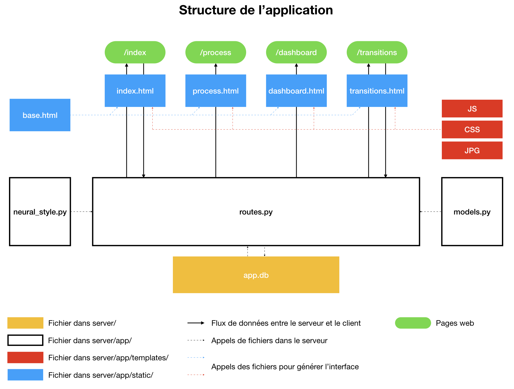

# Documentation

Le fichier suivant détail le fonctionnement de l'application ainsi que la configuration du serveur Digital Ocean, à l'issue du mois de mars 2019.

## Application

### Structure

Le [site](https://gan4vis.net) actuel est constitué de quatre pages web. 

* [/index](https://gan4vis.net/index) : accueil accessible à [https://gan4vis.net](https://gan4vis.net) permettant d'effectuer le transfert de style.
* [/process](https://gan4vis.net/process) : page accessible depuis l'accueil détaillant le processus de création de la plateforme
* [/dashboard](https://gan4vis.net/dashboard) : page non accessible depuis l'accueil, uniquement accessible à [https://gan4vis.net/dashboard](https://gan4vis.net/dashboard) présentant un tableau de bord d'utilisation de la fonctionnalité transfert de style.
* [/transitions]() : page seulement accessible à 

L'application permettant de gérer ce site a une structure MVT (Model View Template). Elle fait appel à un ensemble de fichiers statiques ainsi qu'une base de donnée SQLite. Ci-dessous un schéma de l'architecture de l'application :

<p align="center">

</p>

Sur le schéma précédent, les templates sont en bleu. En blanc se trouvent les View (routes.py) et les Model (models.py). Un fichier python appelé neural_style.py permet le chargement et l'application des modèles de transfert de style utilisés.

### Données

Les données manipulées par l'application sont de trois formes, modèles, images et base SQLite

**Modèles**

Les modèles sont des fichiers .pth stockés dans le dossier gan4vis/server/app/gan/saved_models/. Nous pouvons générer les modèles pour l'application de transfert de style comme pour celle de transitions. [William]

**Images**

Les images stockées sur le serveur correspondent aux images générées lors de chaque transfer de style ainsi que les images utiles dans les affichages divers. Toutes les images se trouve dans les sous dossiers de gan4vis/server/app/static.

**Base SQLite**

Nous avons opté pour une base SQLite pour enregistrée les configurations des transferts de style réalisés. Cette base correspond au fichier gan4vis/server/app.db. Elle est constituée d'une unique table appelée transfer. Nous avons fait le choix d'utiliser [SQLAlchemy](https://www.sqlalchemy.org/) pour travailler avec la base dans notre application. La structure de la base est reliée au fichier "models.py". Celui-ci defini une class appelée "Transfer" qui correspond à la table de la base. Les colonnes de cette table correspondent aux aspects des transferts de style dont nous souhaitons garder la trace. Ci-dessous un exemple d'entrée de la table.

* **token** : identifiant unique généré automatiquement correspondant à un transfert de style. Cet identifiant permet de nommer l'image et est intégré à l'URL afin de pouvoir partager et recharger un transfert de style. Ce point sera détaillé plus bas.
* **date** : date du transfert de style.
* **model** : modèle utilisé
* **distribution** : distribution utilisée
* **datapoints** : valeurs des points utilisés dans le graphique, reliés par des "_"
* **grid** : type de grille utilisé
* **orientation** : orientation de la figure
* **ratio** : niveau de zoom décidé par l'utilisateur

**Attention** Tout changement dans le fichier "models.py" doit être effectué avec précaution. Tout changement doit être suivi d'une migration avec les étapes suivantes 

```console
$ flask db migrate
$ flask db upgrade
```

Des modifications importantes pourront nécessiter une adaptation des données précédentes et donc une intervention sur la base. Nous renvoyons vers le [tutoriel Flask de Miguel Grinberg](https://blog.miguelgrinberg.com/post/the-flask-mega-tutorial-part-iv-database) pour voir comment accéder et modifier la base de données depuis la ligne de commande.

### Processus

Nous allons à présent détailler le processus à l'oeuvre lors de l'utilisation de chacune des pages web. Nous détaillerons plus particulièrement les opérations liées au transfert de style et à la transition.

**Transfert de style**

1. L'utilisateur se connecte à l'interface d'accueil. 
2. L'interface est générée par aggrégation d'information venant du serveur et un ensemble de fichiers (html, js, css et images). L'utilisateur peut alors paramètrer le transfert de style en modifiant la visualisation et en choisissant un modèle.
3. L'utilisateur clique sur le bouton d'application du transfert de style. Une requête AJAX part alors du serveur contenant les paramètres de la visualisation ainsi qu'une chaîne de caractères correspondant à l'image d'entrée.
4. Une fonction "treatment" présente dans le fichier "routes.py" est alors en charge du transfert de style. La fonction appelle une fonction présente dans "neural_style.py" et stocke les caractéristiques du transfert dans la base de données grâce au fichier "models.py" 
5. Une fois le transfert effectué, la fonction "treatment" renvoie un token qui correspond à l'identifiant de l'opération de transfert de style en cours. 
6. L'arrivée du token chez le client permet une mise à jour de l'URL par jQuery et une mise à jour de l'image de sortie par requête GET de l'image correspondant à l'identifiant au serveur.

**Dashboard**

Un système de dashboard a été mis en place afin de rendre compte de l'utilisation de la partie transfer de style ouverte au public. Une simple route appelée "dashboard" a été créée. Elle parcourt la base de données afin d'envoyer au client les données d'utilisation. Le client les exploite ensuite à l'aide de D3.js (version 5) afin de créer les graphiques.

**Transition**

**Partage d'URL**

Nous avons souhaité pourvoir partagé une application de transfert d

## Serveur

### Vue d'ensemble

**Spécifications**

**Accès**
SSH (utilisateurs / root) éviter la console Digital Ocean ! Configuration d'accès avec ressource

### Configuration

**NGINX**

**Gunicorn**

**Flask**

**Gestion**
Logs et mise à jour utilisant Git

**DNS et Réseau**


