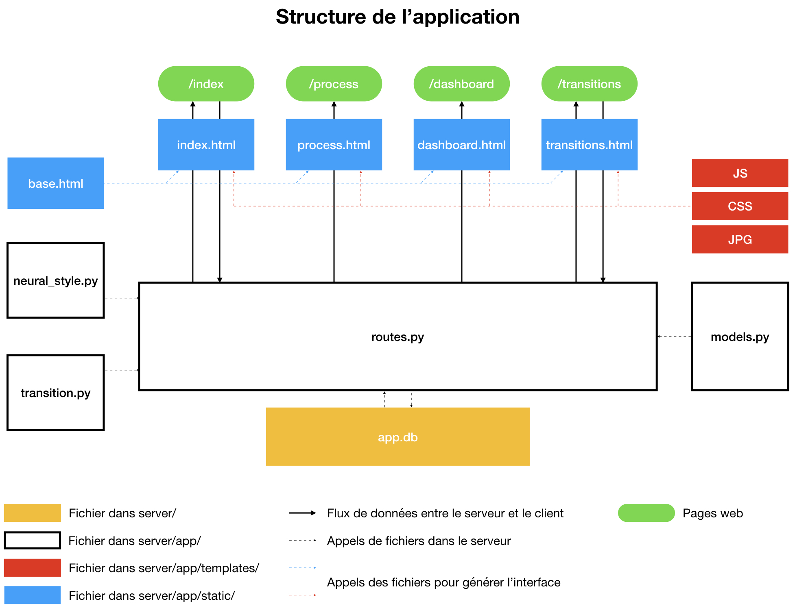

# Documentation

Le fichier suivant détail le fonctionnement de l'application ainsi que la configuration du serveur Digital Ocean, à l'issue du mois de mars 2019.

## Application

### Structure

Le [site](https://gan4vis.net) actuel est constitué de quatre pages web. 

* [/index](https://gan4vis.net/index) : accueil accessible à [https://gan4vis.net](https://gan4vis.net) permettant d'effectuer le transfert de style.
* [/process](https://gan4vis.net/process) : page accessible depuis l'accueil détaillant le processus de création de la plateforme
* [/dashboard](https://gan4vis.net/dashboard) : page non accessible depuis l'accueil, uniquement accessible à [https://gan4vis.net/dashboard](https://gan4vis.net/dashboard) présentant un tableau de bord d'utilisation de la fonctionnalité transfert de style.
* [/transitions] : page seulement accessible à 

L'application permettant de gérer ce site a une structure MVT (Model View Template). Elle fait appel à un ensemble de fichiers statiques ainsi qu'une base de donnée SQLite. Ci-dessous un schéma de l'architecture de l'application :

Sur le schéma précédent, les templates sont en bleu. En blanc se trouvent les View (routes.py) et les Model (models.py). Un fichier python appelé neural_style.py permet le chargement et l'application des modèles de transfert de style utilisés.

### Processus

Nous allons à présent détailler le processus à l'oeuvre lors de l'utilisation de chacune des pages web. Nous détaillerons plus particulièrement les opérations liées au transfert de style et à la transition.

**Transfert de style**

1. L'utilisateur se connecte à l'interface d'accueil. 
2. L'interface est générée par aggrégation d'information venant du serveur et un ensemble de fichiers (html, js, css et images). L'utilisateur peut alors paramètrer le transfert de style en modifiant la visualisation et en choisissant un modèle.
3. L'utilisateur clique sur le bouton d'application du transfert de style. Une requête AJAX part alors du serveur contenant les paramètres de la visualisation ainsi qu'une chaîne de caractères correspondant à l'image d'entrée.
4. La route 
5.
6. 

**Transition**

**Dashboard**

**Partage d'URL**

### Données

Fichiers (Images / Modèles(+génération de modèle)

Base de données et Modèles (SQLite, SQAlchemy, mise à jour de la base de données 

## Serveur

### Vue d'ensemble

**Spécifications**

**Accès**
SSH (utilisateurs / root) éviter la console Digital Ocean ! Configuration d'accès avec ressource

### Configuration

**NGINX**

**Gunicorn**

**Flask**

**Gestion**
Logs et mise à jour utilisant Git

**DNS et Réseau**

